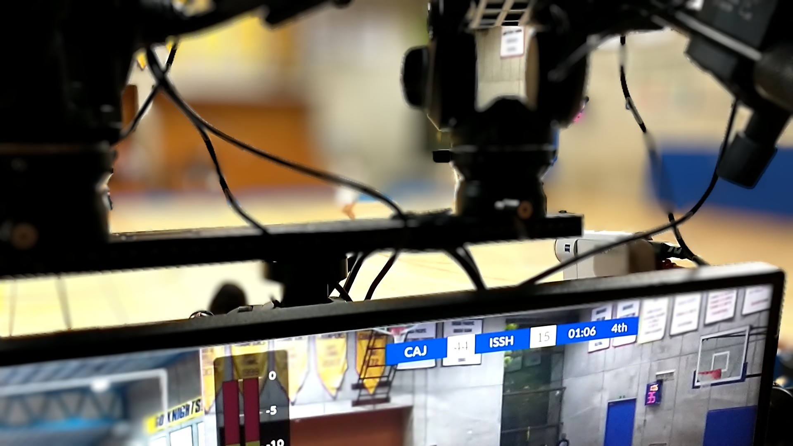

# Daktronics All Sport 5000 for Rust

> Easily decode the serial output of a console and optionally serialize it.

[](https://docs.rs/daktronics-allsport-5000)
[](https://crates.io/crates/daktronics-allsport-5000)
[](https://github.com/daktronics-allsport-5000-rs/iced/blob/master/LICENSE)
[](https://crates.io/crates/daktronics-allsport-5000)
[](https://github.com/zabackary/daktronics-allsport-5000-rs/actions/workflows/ci.yml)



A Rust implementation of decoders for the Daktronics All Sport 5000's serial
output. Please see the [documentation](https://docs.rs/daktronics-allsport-5000)
for more help.

daktronics-allsport-5000-rs is the most complete library for decoding Daktronics'
All Sport 5000 console's serial output in real-time.

This is a Rust library and thus can be installed using Cargo, the Rust package
manager. However, a standalone binary is under development for integration in
non-Rust workflows.

> [!NOTE]
>
> If you use this crate: let me know about your use case by
> [creating a GitHub discussion](https://github.com/zabackary/daktronics-allsport-5000-rs/discussions)
> or starring! It also lets me know other people find this crate interesting and
> useful.

## Installation

Add this to your `Cargo.toml`:

```toml
daktronics-allsport-5000 = "0.4.0"
```

Or if you want to use the `serde` feature:

```toml
daktronics-allsport-5000 = { version = "0.4.0", features = ["serde"] }
```

Or do it with the CLI:

```sh
cargo add daktronics-allsport-5000
```

## Cargo features

- Default features: `tokio-serial`
- `tokio-serial`: Enables support for serial communication using the
  `tokio-serial` crate.
- `tokio`: Enables asynchronous support using the `tokio` crate.
- `async`: Enables support for asynchronous programming, which as of right now
  only works with Tokio.
- `serde`: Enables serialization support of sports using the `serde` crate.

## Where is this used?

I made this crate to use in another project I'm working on,
[`daktronics-singular-ui`](https://github.com/zabackary/daktronics-singular-ui)
(also open source on GitHub), which allows producers to link together Daktronics
All Sport 5000 controllers with a Singular.Live overlay in real time.
This powers overlays for
[Christian Academy in Japan sports livestreams](https://caj.ac.jp/live).

## Usage

### High-level access

Create a new `RTDState` instance with `RTDState::from_serial_stream` (available
with default features enabled). Get the `SerialStream` with `tokio_serial::new`
then `open_native_async`. Check out the examples for more help.

If you need any help, there should be more extensive documentation for each item
at [docs.rs](https://docs.rs/daktronics-allsport-5000). Don't hesitate to
[create a GitHub issue](https://github.com/zabackary/daktronics-allsport-5000-rs/issues)
if something is unclear, either.

#### Sports

This crate supports all sports the control console supports. For a list of them,
see the
[`sports`](https://docs.rs/daktronics-allsport-5000/latest/daktronics_allsport_5000/sports/index.html)
module documentation.

#### Example: getting a sport-specific field

```rust
use daktronics_allsport_5000::{
    RTDState,
    // there are lots of other sports available in their respective modules
    sports::basketball::BasketballSport
};
use tokio_serial::SerialPortBuilderExt; // for open_native_async
use crate::daktronics_allsport_5000::sports::Sport; // for rtd_state

#[tokio::main]
async fn main() {
    let serial_stream = tokio_serial::new("/dev/ttyUSB0", 19200)
        .parity(tokio_serial::Parity::None)
        .open_native_async()
        .unwrap();
    let rtd_state = RTDState::from_serial_stream(serial_stream, true).unwrap();
    let mut basketball = BasketballSport::new(rtd_state);

    loop {
        // get the underlying rtd_state to update it
        let update_result = basketball.rtd_state().update_async().await.unwrap();

        basketball.main_clock_time(); // -> Result<&str, ...>
    }
}
```

### Low-level access

When used with the `tokio` feature, this package provides a `tokio-util` codec
implementing `Decoder` to decode packets from a serial stream from the control
console. That is used internally in `SerialStreamDataSource` to route data into
`RTDState`.

If you're not using `tokio` or you're not using a serial stream to deliver the
data (e.g. using UDP), you must get the packets somehow yourself, but after
that, you can use `daktronics_allsport_5000::packet::Packet`'s
`TryFrom<bytes::Bytes>` implementation to parse the packet into a readable
format. Then, you can provide that to the main `RTDState` struct by implementing
`daktronics_allsport_5000::rtd_state::data_source::RTDStateDataSource` then
giving that to `RTDState::new`. After that, everything works as normal.

## Inspiration

The same concept as this crate is also implemented in
[Python by @FlantasticDan](https://github.com/FlantasticDan/scorebox-consoles),
[C# by @JimThatcher](https://github.com/JimThatcher/sport-streamer), and
[Python again by @fimion](https://github.com/fimion/pydak). In fact, the data in
this crate is extracted from a PDF provided by @fimion, so thank you!

The offsets of the various fields have been processed from a PDF and typed by
hand. If you're interested in porting this crate to another language, check out
the Excel spreadsheet I compiled with the data that underpins this crate in
[`./sports_data`](./sports_data/).

Given that this protocol is technically proprietary, please note that this crate
does not come with any warranty. For more details,
[see the license](./LICENSE.md).
